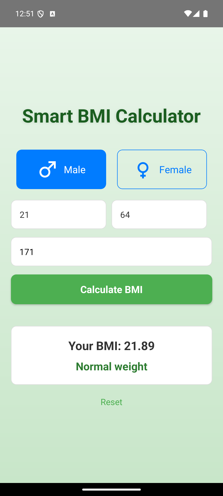
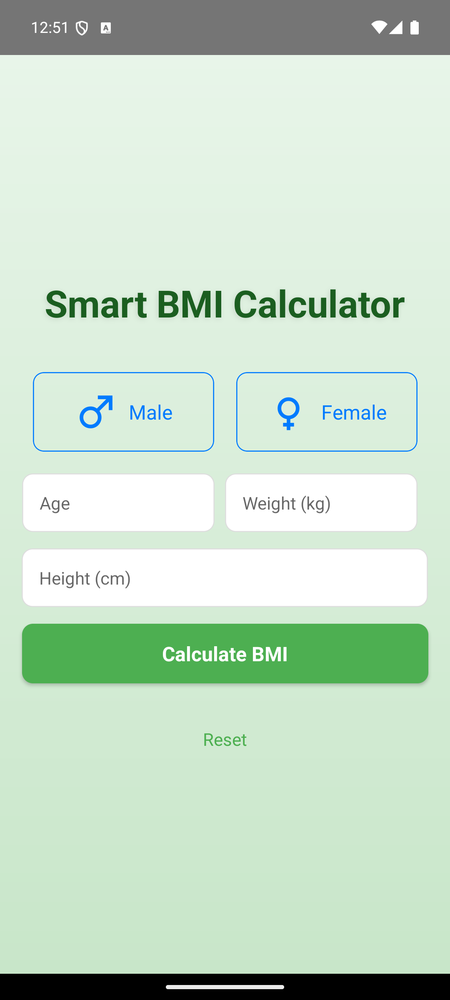

# 📱 Smart BMI Calculator (React Native)

**Smart BMI Calculator** is a modern, cross-platform mobile application built with **React Native**. It helps users calculate their Body Mass Index (BMI) based on their height, weight, age, and gender, providing instant health feedback with a clean and intuitive interface.

---

## 📸 App Preview

Here's a sneak peek of the app in action:

<!--  -->
<p align="center">
  
  
</p>
---

## 💡 Features

-   **Modern UI**: A clean, user-friendly interface with a light green gradient background.
-   **Comprehensive Calculation**: Calculates BMI using weight, height, age, and gender for more accurate results.
-   **Interactive Gender Selection**: Easy-to-use buttons with icons for gender selection.
-   **Instant Feedback**: Immediately displays the calculated BMI and corresponding health category (e.g., Underweight, Normal, Overweight, Obese).
-   **Reset Functionality**: A "Reset" button to quickly clear all inputs.
-   **Cross-Platform**: Built with React Native for a consistent experience on both Android and iOS.

---

## 🛠 Technologies Used

-   **React Native**: For building the core mobile application.
-   **TypeScript**: For type-safe JavaScript code.
-   **React Native Vector Icons**: For including custom icons in the UI.
-   **React Native Linear Gradient**: For creating beautiful gradient backgrounds.
-   **Metro Bundler**: For bundling the application.
-   **Android & iOS**: Native modules for platform-specific functionalities.

---

## 📁 Project Structure

```
└── BMI-Calc-ReactNative
    ├── src/
    │   └── components/
    │       └── GenderSelector.tsx
    ├── App.tsx
    ├── index.js
    ├── android/
    ├── ios/
    ├── package.json
    └── screenshot.png
```

---

## 🚀 Getting Started

### Step 1: Start Metro Bundler

```bash
npm start
# or
yarn start
```

### Step 2: Run the App

#### For Android

```bash
npm run android
# or
yarn android
```

#### For iOS

```bash
npm run ios
# or
yarn ios
```

---

## 🧪 Testing

Test cases are present inside the `__tests__` folder and can be run using:

```bash
npm test
```

---

## 📝 License

This project is licensed under the MIT License.

---

## 👤 Author

Made with ❤️ by [Sonal Jaiswal](https://github.com/Sonal-Jaiswal) 
